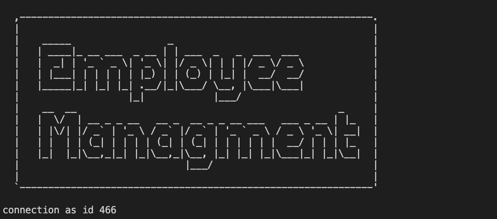

# Employee-Tracker

This is an employee management system that utilizes SQL to read and store data.

Video Demo: https://drive.google.com/file/d/1uUexr9znF1tO_6avUG7Uhhb2j16GSy5c/view?usp=sharing

---

## **Table of Contents**

1. [Links](#Links)
2. [Installation](#Installation)
3. [Technologies Used](#Technologies-Used)

---

## **Installation**
You can start this this application by first:

``npm i``

Then using:

``starting database``

Starting:

``node index.js``

## **Links**

[GitHub repository](https://github.com/dkim525/Employee-Tracker)

---
## **Technologies Used**
* HTML
* CSS
* Node.js
* SQL